# IBM IT Architect Assistant, Community Edition - Detailed Authoring by Artifact Type
This section will present the details for each of the artifact types, including the purpose of the artifact/artifact instances, the underlying meta-model, and how to manipulate them.

- [Back to Core User Guide](./Overview-ITAA-CE.md)
- [Overview](#overview)
- [Business Challenge](#business-challenge)
- [System Context](#system-context)
- [Use Cases and Use Case Diagrams](#use-cases-and-use-case-diagrams)
- [Functional Requirements](#functional-requirements)
- [Non-Functional Requirements](#non---functional-requirements)
- [Logical Data Model](#logical-data-model)
- [AOD Services View](#aod-services-view)
- [AOD Enterprise View](#aod-enterprise-view)
- [AOD IT System View](#aod-it-system-view)
- [AOD Usage Scenario](#usage-scenarios)
- [Architectural Decisions](#architectural-decisions)
- [Component Model - Static View](#component-model---static-view)
- [Component Model - Dynamic View](#component-model---dynamic-view)
- [Logical Operational Model](#operational-model---lom-view)
- [Physical Operational Model](#operational-model---pom-view)
- [Viability - Risks](#viability---risks)
- [Viability - Assumptions](#viability---assumptions)
- [Viability - Issues](#viability---issues)
- [Viability - Dependencies](#viability---dependencies)
- [Architectural Principles](#architectural-principles)
- [Notes](#notes)

## Overview
The overview or executive summary is presented to users in the Quick View and forms the first section of the default document and presentation export reports. From a model perspective it is just has a "document body" that can include rich-text and images.

## Scope
A key aspect of a solution architecture is to communicate what the solution is trying to solve and how it will integrated within the larger enterprise IT environment. There are two artifacts to support this solution "scope" communication, the Business Challenge and the System Context.

### Business Challenge
The business challenge is designed to document what client need or challenge is the focus for the solution architecture. This is important to level-set the business value target for the solution. In future versions of the tool, the business challenge will likely play an important role (through NLP and NLC) to locate other architectures that seem to be trying to solve similar needs or challenges. Thus, whenever possible, this artifact should be populated at least with a bullet-ed list of keywords that establish the core problem being solved (solutioned).

From a model content standpoint, this is similar to the overview in that there is a simple "document body" that can include rich-text and images. Given the statement above, you should attempt to focus on the rich-text description as this will be much more likely to be parsed and interpreted through future ML-based classification tools.

### System Context
The system context diagram is an extremely important tool to specify the scope of the solution architecture.  In this diagram, the solution architecture is represented as a black-box via a **target system** element. Everything else displayed on the diagram is considered to be an **actor** that interacts or integrates with the solution (target system).

The target system element has a name and description. The description will likely be a summary of a combination of the business challenge and the overview.

Actors have a subtype of either **Human** or **IT System** to indicate whether the interface is between another system component or a user. Actors are important shared elements within the solution architecture. They will appear in Use Cases, on Use Case Diagrams, and within both Component and Operational Model artifact instances.

Typically the diagram will then show connections (**connector**) between each actor and the target system. The connector names and description should provide information into the nature of the integration.  In fact the connector has a "type" attribute with potential values of (*function, data interface, list of use cases, or connection mechanism*). This type provides some insight into what kind of interaction/interface is being documented via the connector.

The current meta-model restricts an architecture having only one System Context diagram and within that System Context diagram having only 1 target system element. There are several reasons for this restriction, most notably, that when more than one solution is included, the distinction between out-of-scope, boundary elements (**actors**) and in-scope white box functionality (**logical components**) become very confused. Within this "one solution architecture - one IBM Architect Assistant, Community Edition asset" constraint, one can still document separate "phases" of a phased solution. In this case some of the actors and actor to system interactions (connector) are only applicable within certain project phases. Use colors and other annotation within the system context diagram to allow the overall system view for a particular phase to be identifiable.

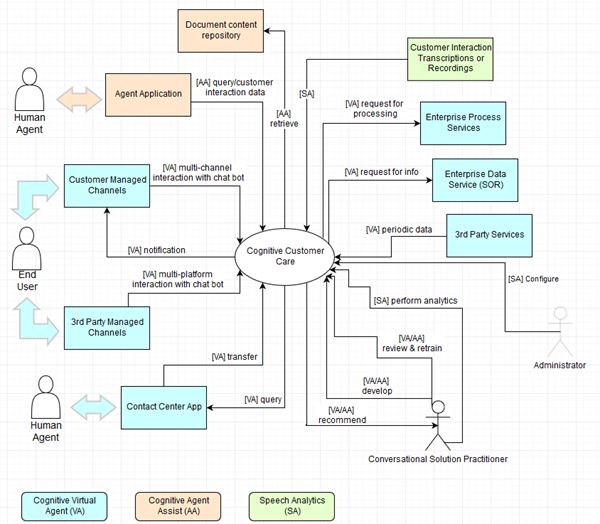

*System Context diagram with multiple phases or scenarios*

([Back to Top and TOC](#ibm-it-architect-assistant-community-edition---detailed-authoring-by-artifact-type))

## Requirements
It is important to document and **track** the definitive set of requirements on the solution. This is to make sure that all parties understand what will and won't be delivered (functionally) as well as the expected qualities of that solution. There are three artifacts in IBM Architect Assistant, Community Edition used to communicate the solution's requirements: 1) Use Cases, 2) Functional Requirements, and 3) Non-Functional Requirements.

### Use Cases and Use Case Diagrams
Use Cases are a familiar way to document the functional behavior of the solution from the perspective of an initiating actor's perspective. There are two linked artifact types within IBM Architect Assistant, Community Edition to capture use cases. A high-level Use Case Diagram (UCD), allows one to quickly see the relationship between a set of Actors and a set of Use Cases. A diagram can include Use Cases, Actors, and Use Case associations.

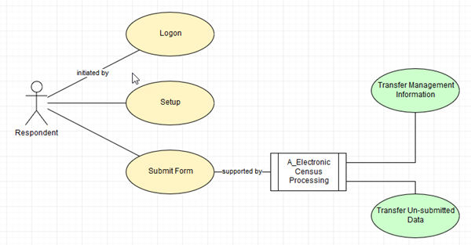

With the focus on the relationship between the Actors and a set of Use Cases, a limited amount of detail about each use case is presented in the attribute panel. However, the shared Use Case element has a rich set of attributes that are fully exposed in the corresponding Use Case (text) artifact instance. You can see the link to the detailed use case in the attribute panel.

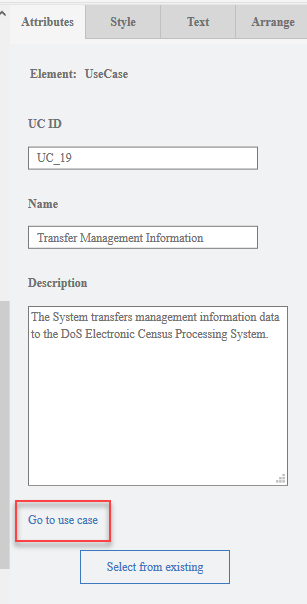

The Use Case artifact instances are form-based text. They form the more complete Use Case Model but are less visual and in some case not required to be elaborated, at least early in the sales cycle.

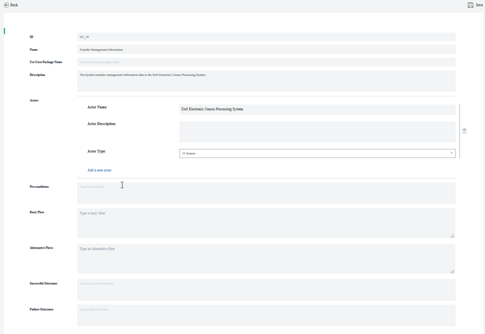

The tool coordinates these two use case artifacts to maintain data model consistency. This involves several actions. One such action is if a new use case is created within a Use Case Diagram instance, then that Use Case will show up and be editable as a Use Case artifact instance. In a similar way, if an association is made or deleted between an Actor and a Use Case (either in the Use Case artifact instance or on a UCD), then the corresponding association is updated everywhere.

Note that an author can choose to select the Actors and Use Cases to be presented within a UCD instance. If you build at least some of the Use Case Model via the Use Case artifact instances, then you will have the corresponding (existing) Actors and Use Cases available in special palettes from which you can drag and drop these predefined elements onto the UCD.

([Back to Top and TOC](#ibm-it-architect-assistant-community-edition---detailed-authoring-by-artifact-type))

### Functional Requirements
Functional Requirements (FRs) are a complementary (or alternative) way to describe what the target system is expected to be able to do. Like the text based Use Cases, FRs can be edited via a "web form" style editor. Each FR has a set of attributes:

- **ID** - This is a text label, used for sorting, and often needing to align with a client (RFP/RFI) labeling for tracking purposes.
- **Name** - This is a text name which should provide an indication of what the system needs to provide
- **Description** - This is text that should provide the detailed requirement details
- **Impact** - An explanation of the significance or impact of delivering this requirement
- **Weight** - [Low, Medium, High] used to prioritize across requirements
- **Owner** - Entered as a name or email address of the responsible party for making sure this requirement is addressed by the system.
- **Review Date** - Ability to schedule a review.
- **Logical Components** - This is a {set of] relationships between Logical Component and a particular FR. This help form the Requirements Matrix work product in which the set of Functional Requirement are listed along with which Logical Components deliver those capabilities within the solution.  The Editor provides a pick list of the currently existing Logical Components available in the Solution Model.

FRs are generally managed and reviewed as a table or spreadsheet. As such the Excel import and Excel export utilities of IBM Architect Assistant, Community Edition are extremely useful when working with FRs. 

The relationship between an FR and a Logical Component is bi-directional and managed as such in the tool's graph database. However, currently the UI only shows this relationship from an FR. An FR is not presented as a relationship attribute when working with a Logical Component.

([Back to Top and TOC](#ibm-it-architect-assistant-community-edition---detailed-authoring-by-artifact-type))

### Non-Functional Requirements
Non-Functional Requirements (NFRs) provide a way to document the qualities and constraints of the system. Like FRs, NFRs are authored via a "web form" style editor.  Each NFR has a set of attributes:

- **ID** - This is a text label, used for sorting, and often needing to align with a client (RFP/RFI) labeling for tracking purposes.
- **Name** - This is a text name which should provide an indication of what quality the system needs to provide
- **Description** - This is text that should provide the requirement details
- **Theme** - One of [Performance, Volumetrics, Scalability, Security, Regulatory Compliance, Usability, Maintainability, Availability, Manageability, or Environmental].  These are used to group NFRs in reports.
- **Context** - Text describing the context for the applicability of the NFR.
- **Value** - Many NFRs will describe a metric, this is where the target value for that metric is specified.
- **Growth Rate** - Some NFRs may expect the base metric "grows" or changes over the life of the system. This is used to indicate this rate.
- **Acceptance Criteria** - Particularly where the target can't be specified with a metric value, describe what quality criteria is acceptable.
- **Priority** - One of [Critical, Desirable, or Optional], this is a variation on the MoSCoW labeling.
- **Source** - A description of the source of the requirement, e.g., a compliance guideline, useability rules, or external or internal policy.
- **Reference** - A description or link to any reference that the system needs to conform to.
- **Test Method** - A description of the approach to be used to verify system meets the requirement.
- **Owner** - Entered as a name or email address of the responsible party for making sure this requirement is addressed by the system.
- **Review Date** - Ability to schedule a review.

Like FRs, NFRs are generally managed and reviewed as a table or spreadsheet. As such the Excel import and Excel export utilities of IBM Architect Assistant, Community Edition are extremely useful when working with NFRs.

NFRs and Architectural Decisions generally apply to a particular part of the solution architecture and the applicable architecture elements provide some context for how to apply each. Therefore NFRs are relationship attributes for many of the core architecture elements within a Solution Architecture. 

([Back to Top and TOC](#ibm-it-architect-assistant-community-edition---detailed-authoring-by-artifact-type))

## Data Model

### Logical Data Model

The Logical Data Model artifact type provides the ability to create instances of an Entity-Relationship diagram (ERD). There are 3 key elements that appear (as symbols) on an E-R diagram, Entities, Relationships, and Generalization (IS-A).  In addition to the typical name and description attributes, and entity can have any number of *attribute* attributes. In the current meta-model and attribute has a name, description and type (e.g., String, Customer, ...).  A relationship connects two Entities.  There is a multiplicity indication next to each entity to indicate the multiplicity of that entity that can participate in the relation.  A relationship can also have *attribute*s associated with them.  Finally, you can indicate that an Entity specializes or has a generalization/Is-A relationship with another Entity.   This Is-A relationship is represented by a triangle.

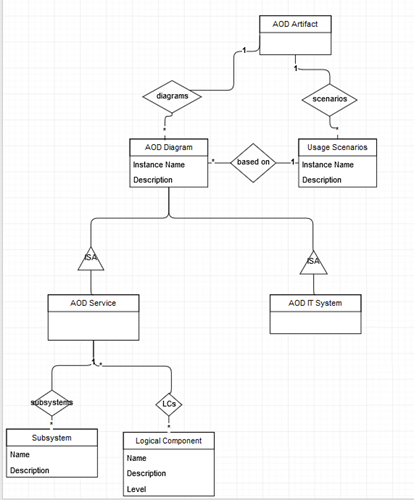

([Back to Top and TOC](#ibm-it-architect-assistant-community-edition---detailed-authoring-by-artifact-type))

## Architecture Overview
In Architectural Thinking, an Architecture Overview provides a high-level description of the solution. It is sometimes likened to the "back of the envelope" architecture used to create a common understanding and to elicit further conversation to drive out details. Often several different styles of Architecture Overview Diagram (AOD) will be employed to communicate different views of the architecture vision to different stakeholders.

Within IBM Architect Assistant, Community Edition the, otherwise freeform, AOD is offered in just three standard styles:

- AOD Services View
- AOD Enterprise View
- AOD IT System View

In addition to these three standard styled AODs, IBM Architect Assistant, Community Edition supports authoring walkthroughs (or Usage Scenarios) as an overlay to any of the AOD views. This again provides a standard approach to the common practice of describing a Use Case (Usage Scenario) in the context of the solution architecture.

### AOD Services View
One of the ways to describe a solution is via the set of functions or services that it delivers. One can be very formal about the functional viewpoint by populating the Component Model, but often it is reasonable to just show the set of interacting capabilities (services) and how they potentially interrelate.  This is the essence of the AOD Services View. The majority of the diagram consists of **Logical Components** (which can be reused / referenced in a more formal Component Model) and **Logical Connectors** optionally between them. The other primitive supported on this diagram type, **Subsystems**, can be used to show the logical relationship (group) of a set of Components or as a stand-in for an incomplete set of Components that deliver a range of [related] capabilities.

A common look and feel for an AOD Services View is a "layered architecture". Here is an example showing the high-level One IBM Cloud Architecture.  This example only makes use of Subsystems and Logical Components -- the relationships are described via the grouping and the relative placement of the *layers*.

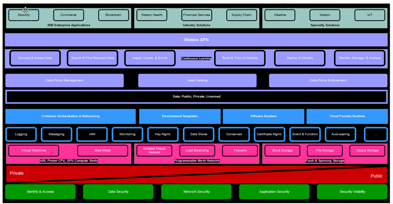

This simple style, can communicate a lot of information. But a simple picture is open to ambiguous interpretation. Here is where populating the attributes of the underlying elements is extremely important. Like all architecture elements in the tool, Subsystems, Logical Components and Logical Connectors have a name and a description attribute.  The name is visible on the diagram.  The description is where you can provide detailed explanation about the purpose and capabilities associated with each element.

Logical Connector - this element can be added to a diagram without supplying a name. In addition, even if you supply an name, there is a diagram level toggle option whereby you can hide the display of the connector's name on the diagram.  You may choose to do this to de-clutter the view.

Each Subsystem is a container.  The tool will maintain information about which Subsystems and Logical Components are contained within it. But for the most part that information doesn't drive any other behavior in the tool.

Logical Component - this element type is crucial to the information communicated through this diagram type. As noted, it can be reused in the Component Model (and indirectly via Deployment Units in the Operational Model). A Logical Component can be referenced by a Functional Requirement. This provides the traceability between the FR and which component(s) deliver that requirement. This "relationship attribute" is managed and viewed through the FR editor. A similar attribute can link a Logical Component to a collection of NFRs.  This is directly managed in the attribute panel for the Logical Component. And similarly a Logical Component can be linked to Architecture Decisions (see below). The user experience for these two relationship attributes is: 

- if an NFR or Architecture Decision is associated with the LC, then it will appear in the corresponding attribute field (e.g., NFR02 - ...)
- if there is a defined Architecture Decision / NFR there will always be a link to **Associate ...**.  Clicking this list brings up a list of all of the corresponding element of the association type available in the solution architecture with checkboxes allowing you to select or deselect an element to associate.
- you cannot create either an Architecture Decision or NFR through this attribute field, so no *Associate ...* link will be available if no such element currently exists.

Logical Component Implementation - Logical vs. Physical.  Frequently when communicating about the functional aspects of a solution, it is important to take the default "Logical" perspective without exposing implementation choices. At the same time it is known that when the solution is deployed one or more physical implementations will actually deliver the capability.  The attribute *Implementation* allows the author to associate a set of implementation choices. In a final solution architecture, only the decided upon implementation will be linked. Within a Reference Solution / Reference Architecture it  a set of choices may be provided as insight in how the solution can be realized.  It is only through this implementation attribute that one can author and edit the details of a **Physical Component**.

In the above, you see three different implementations associated with this LC. You can click on the arrow symbol next to the Implementation name to bring up an editor for the corresponding Physical Component.

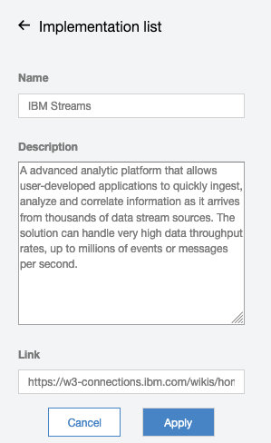

Clicking on the **Add/Update Implementation** link will provide a list of all available Physical Components defined in this Solution Architecture (to select or deselect).  It also provides a link to **Create New** which allows you to define a new Physical Component to select.

([Back to Top and TOC](#ibm-it-architect-assistant-community-edition---detailed-authoring-by-artifact-type))

### AOD Enterprise View
The AOD Enterprise View seeks to depict a solution through its Business Architecture.   The presents the architecture through 3 standard layers: Channels (a type of logical component that deliver services to a type of user/actor), Application Services (a type of logical component that deliver the core business functionality) and Resources (a type of logical component that represent current, dependent capabilities). In addition to Channels, Application Services and Resources, the diagram supports Actors (Human actors), SubSystem (used to group different set of components) and Logical Connectors.

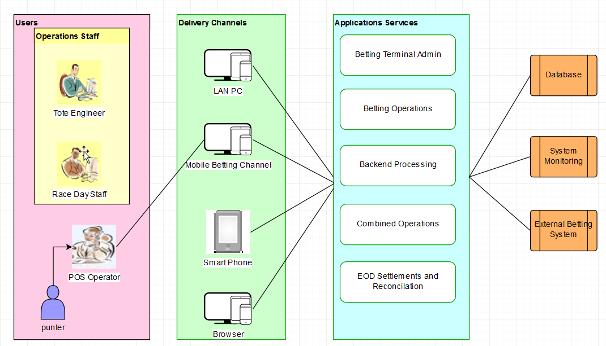

([Back to Top and TOC](#ibm-it-architect-assistant-community-edition---detailed-authoring-by-artifact-type))

### AOD IT System View
Another common way to describe the system is to focus on a logical deployment view. The IT System View is comprised of Locations, Subsystems, Logical Nodes, and Logical Connections. In the more formal Operational Model, Nodes are containers into which functional behavior is deployed. In the more informal IT System View, the details of the deployment units are essentially ignored and instead a Logical Node embodies the net contribution of capabilities available to the solution in a logical packaging within a particular location.

Within IBM, this style is extremely common and is the approach promoted through sites like the . IBM Architect Assistant, Community Edition has formalized this style in the IT System View. Logical Node symbols have an associated icon (an image file). Many of the common CAC node symbols are delivered via a special set of domain specific "palettes" in the IT System View. 
Note, in addition to the node icons available via the palettes the standard CAC icons are available via the Architecture Pattern, **IBM Architecture Node Library**, that can be reused (copy and paste) via the Resource menu and contains both diagram templates as well as reusable Logical Nodes.

One of the validation rules enforced by the IT System View is a Logical Node must be *placed* within a Location. Thus it is not valid for a Logical Node to appear standalone within an IT System View diagram.

In most cases, an important part of this "deployment view" is the connectivity between Logical Nodes.  Logical Connections help tell the story about how the system is "wired together". 

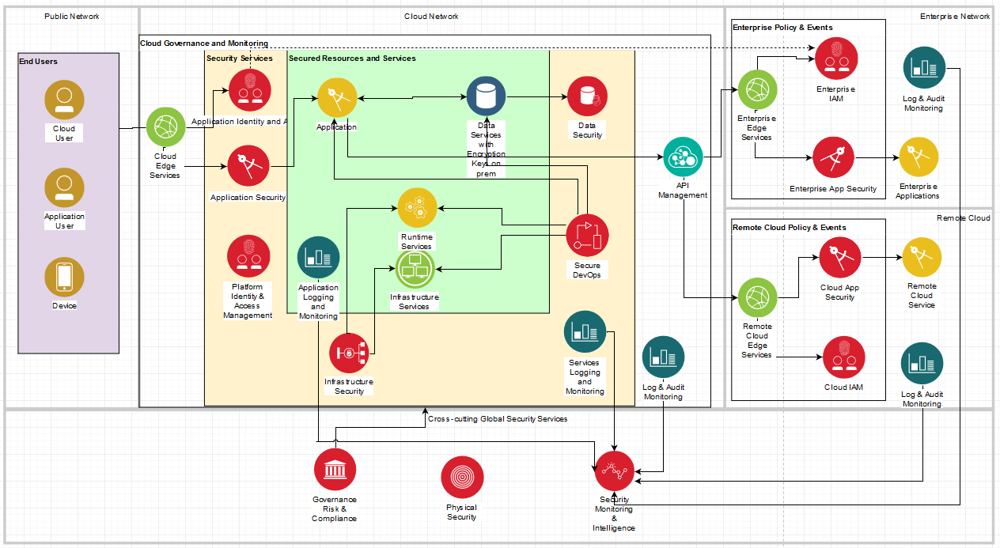

A Subsystem is commonly used when you need to simplify connection details by showing implicit connectivity between a set of Logical Nodes.  By placing Logical Nodes within a Subsystem, you can then have a Logical Connection endpoint connect to a Subsystem instead of a Logical Node.

When creating these diagrams you will frequently want to make use of all of the tabs on the format panel, such as endpoint style and line jumps for Logical Connections on the Style tab, Edit Image for Logical Node on the Style tab, and alignment tools in the Arrange tab. 

As noted earlier, the details associated with deployment units are ignored in the IT System view, however it is often the case that one wants to identify the "implementation elements" that are represented by a logical node. Thus, one of the attributes of a Logical Node is **Implementation**. You can think of an Implementation as a short-cut to a DU (either application or technical). The user experience is identical to that described earlier for a Logical Component's implementation in the AOD Services View. The Add/Update Implementation link within the Implementation attribute allows you to select from the list of currently defined Physical Components and/or create new ones.

Also available as attributes on Logical Nodes is associating Architectural Decisions and NFRs. Also, each Logical Connection can be associated with zero or more NFRs.

([Back to Top and TOC](#ibm-it-architect-assistant-community-edition---detailed-authoring-by-artifact-type))

### Usage Scenarios
The usage scenario provides a way to overlay a "story" or "flow" onto an existing Architecture Overview diagram. What is uniquely authored in a Usage Scenario instance, is this story. When a new instances is created, you must first specify the AOD diagram it is based upon (selected from a list) along with the scenario name.

In the editor for a usage scenario, there are no drawing palettes. Instead you are provided with a way to select a "connector" from the underlying AOD diagram and then associate it with one or more *steps*. A step has two attributes, name and description. Further the name must be a single token and either be all numeric or all alphabetic. (The idea is the steps have names: 1, 2, 3, ... or A, B, C, ...).  The description is used to tell the "story segment" associated with the step. When a "connector" is selected, all currently defined steps for the usage scenario are presented along with a checkbox to select or deselect each one. The usage scenario editor will place "step circles" on the selected connector for each associated step. When given the option to select the associated steps, you are also presented with the ability to create a new step.

In addition to adding and associating steps to connectors, you can also select any other (non-connector) symbols and "disable" them.  The editor then will "gray-out" these disabled symbols.  

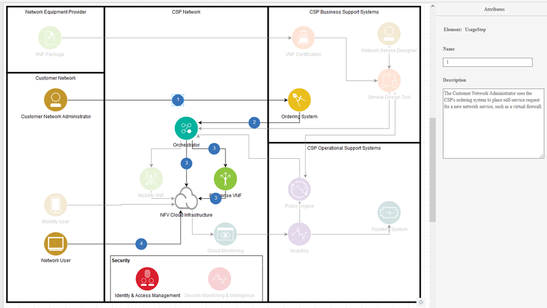

## Architectural Decisions
Architectural Decisions (ArchDs) are central to documenting a solution architecture and providing traceability into the *why* the architecture looks the way it does. An architectural decision is authored via a "web form" style editor.  Each ArchD has a set of attributes:

- **ID** - This is a text label, used for sorting and easy tracking purposes.
- **Name** - This is a text name which should provide an indication of what decision was considered and made.
- **Status** - one of (Proposed, Approved, Deprecated, or Superseded). This established whether the decision is reflected in the solution architecture.
- **Last Update** - A simple timestamp indicated the last time the decision was modified.
- **Subject Area** - along with topic, is a text field used to organize the nature of the ArchD. 
- **Topic** - a second level of organizational taxonomy. 
- **Issue or Problem Statement** - This text field describes the problem or issue being addressed.
- **Assumptions** - this text field captures any assumptions in force and providing the context under which this architectural decision is being considered.
- **Motivation** - this text field established the why is this decision is being considered.
- **Alternatives** - this should be considered a **manditory** - attribute which lists 2 or more alternatives under decision. If there is only a single alternative then there is no decision to be made.
- **Decision** - this attribute presents the selected alternative. What has been decided.
- **Justification** - a text description explaining why the decided upon alternative was chosen over the others. 
- **Implications** - text describing the notable implications that result from applying the decision to the solution architecture.
- **Derived Requirements** - currently text used to reference or describe requirements generated as a result of the decision being made.
- **Related Decisions** - currently text used to reference other architectural decisions that are related to this ArchD.

In addition to documenting a decision, it is convenient to trace them to specific elements of the architecture where it applies. As seen in earlier sections, several core architecture elements appearing on different artifact instance diagrams, provide the ability to be "associated" with one or more applicable ArchDs. ArchDs can be associated with:

- Logical Components
- Logical Nodes
- Deployment Units

([Back to Top and TOC](#ibm-it-architect-assistant-community-edition---detailed-authoring-by-artifact-type))

## Component Model
The Component Model is the most common modeling approach for representing the *Functional Viewpoint* of an architecture.  Within the component model, the system functional behavior is decomposed into a set of *Components*. A Component should deliver a cohesive set of services through well defined *Interface*(s) and will typically own or be responsible for some business data/objects.

The component model clearly needs to document the functional decomposition, i.e., the individual components, the relationship(s) between the components, and the behavior of the components as a collection. The static view artifact is used to describe the components along with their relationships.  The dynamic view (or component sequence view) describes a series of messages exchanged between components to deliver a *Conversation*.

### Component Model - Static View
The Static View in IBM Architect Assistant, Community Edition can include Actors (Human and/or IT System), SubSystems, Logical Components and Logical Connector. Our focus in the static view is the functional decomposition of the system. This decomposition may be shown at different levels of granularity. Note that Actors are external to the target system and all of the Components are intended to represent the functional decomposition of the target system.

SubSystems, just like in other artifacts, are a logical grouping element. Although permitted, you should trying and be very specific about the Components that interact via a Logical Connector and not connect from a SubSystem. If you want to represent a more coarse-grained Component, you can show a hierarchy (Component and Sub-Components) via a simple parent-child containment relationship. 

It is important to consider the by-reference relationship attributes of a Logical Component and where they are exposed in the UI: 

- A Logical Component can satisfy all or part of a Functional Requirement of the system.   This relationship is visible and can be edited within a Functional Requirement artifact instance.
- A Logical Component can be deployed to the Operational Model via a set of Deployment Units (DUs). Note there is a many-to-many relationship between Logical Components and DUs.  A DU currently is only visible and edited within either a Logical Operational Model (LOM) instance or a Physical Operational Model (POM) instance. In each case a DU can be defined and deployed to a Logical/Physical Node and be associated with 1 or more Logical Components.
- A Logical Component can be implemented by 0 or more Physical Components.  This implementation relationship/attribute is available in the attribute panel for a Logical Component.
- A Logical Component can be linked to a set of Architectural Decisions.  Like the "implementation" relationship, this is available in the attribute panel for a Logical Component.
- Finally, a Logical Component can be related to (constrained by) a set of NFRs. The related NFRs are available in the attribute panel for a Logical Component.

Any other details about the Logical Component should be documented in the Description property of the LC.  In particular, what function does the component deliver.  What interfaces or services does it expose and is it dependent on. Also, what data does this component own (is responsible for).

The Logical Connector usually represents a communication channel (interaction dependence) between two Components. This dependency is most important as an overlay onto the Operational Model to verify the appropriate network SLAs are in place to support the interaction between each communicating pair of Components.

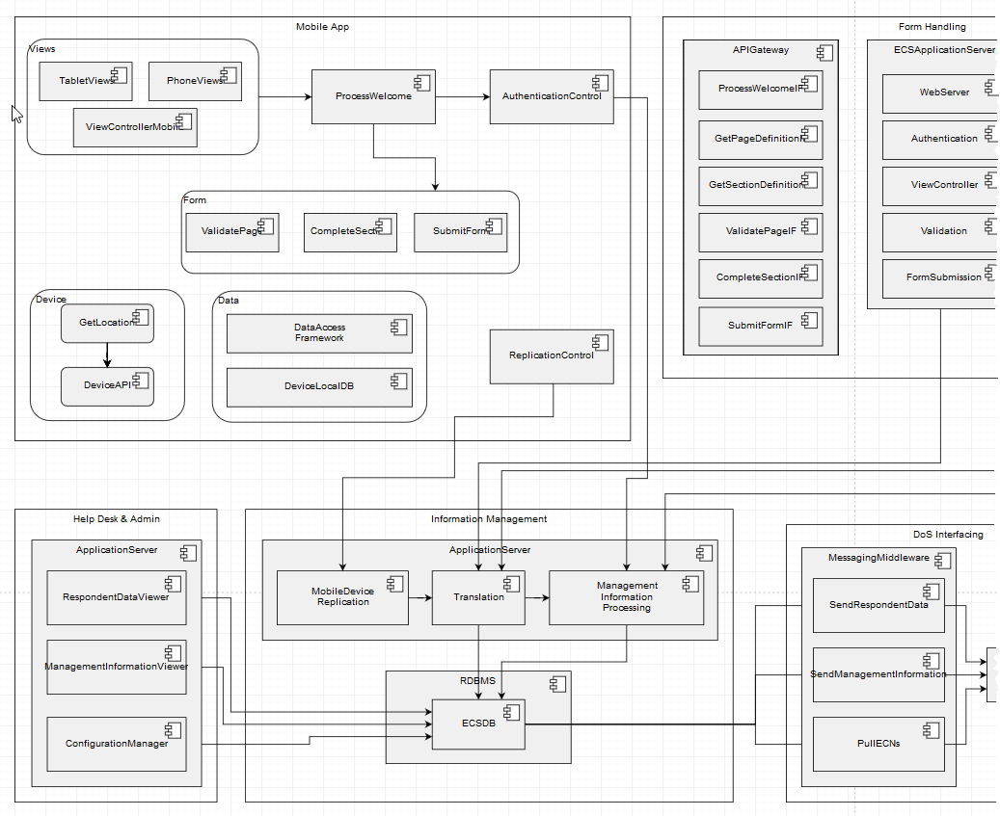

([Back to Top and TOC](#ibm-it-architect-assistant-community-edition---detailed-authoring-by-artifact-type))

### Component Model - Dynamic View

The Dynamic View artifact is also know as the Sequence Diagram. Its purpose is to show the detailed interactions between Actors and Components involved in carrying out a particular task ("conversation").  In this diagram, Actors and Components appear as *timelines*. Time moves forward as you move *down* each timeline. Component Messages are transferred from a sending (calling) *Participant* to a receiving (called) *Participant*. (A Participant is either an Actor or Component.) The dynamic view can support a number of different communication models from synchronous to asynchronous.

The implication is that each "call" invokes a method/service/API either privately or publicly supported by the called *Participant*. For synchronous call-return communication, one can use the *return* message style to show the completion of the invoked operation.

This diagram is all about the Component Messages that make up the documented *conversation*. A Component Message has a **Name** (which is not required to be unique as it often will be a method or API name), a **Description** (generally describing the API/Interface), a **type** (call or return), and the **associated Logical Connector**.  The associated Logical Connector is the way in which you can cross-reference and validate the required Connector between the two participants of the message.

Manipulating the messages in MxGraph does require a bit of practice.  The two most notable tips include:

- Focus on connecting the endpoints of a message to the respective participant timeline. Often the message line will snap to a position on the timeline different from what you want.  Then hover over the midpoint of the message (you will see a midpoint *dot*), then click and drag up or down to re-position the message.  If you try dragging from any place other than the midpoint, moving the message will result in one or both endpoints getting disconnected from the participant timeline.
- When adding and manipulating a "self call" message, first make it wider than the associated timeline (by dragging out the right side).  Then you can manipulate the endpoints and position on the timeline.   Once it is where you want it then you can shrink its width (drag the right side to the left) for more aesthetically pleasing sizing.

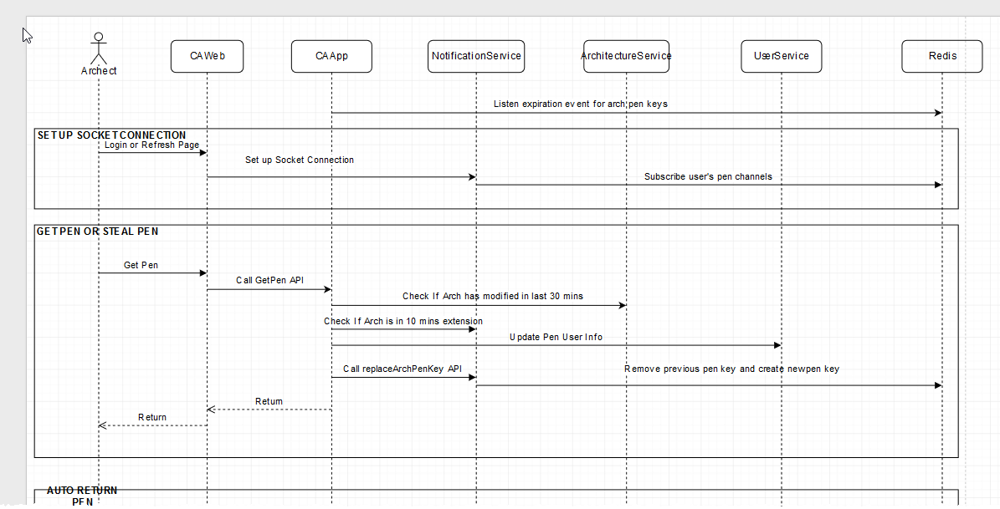

([Back to Top and TOC](#ibm-it-architect-assistant-community-edition---detailed-authoring-by-artifact-type))

## Operational Model
The Operational Model is probably the most involved set of artifacts we create as architects. The focus of this model is to describe the placement of the workloads onto a operational environment insuring that the required service levels are met.

Within IBM Architect Assistant, Community Edition the Operational Model can be described at a logical level, at the physical level, or both. There is a natural layering of the placement or *hosting* relationships. For simple cases IBM Architect Assistant, Community Edition provides synchronization between a Logical Operational Model view and its *linked* Physical Operational Model view.

### Operational Model - LOM View
There are 4 key modeling elements front and center in a LOM view: OMLocations, Actors, Logical Nodes, and Logical Connections. In addition the diagram palette includes element representing different Border types.

An **OMLocation** represent a consistent  (set of characteristics) operating location. The identifying (non-functional) characteristics that are associated with an OMLocation may be, for example, its isolation level from a networking and/or security perspective.

A **Logical Node** represents a collection of compute and storage that can be co-located and hosted on a Physical Node. In general a Logical Node will represent a collection of **Deployment Units** which in turn represent pieces of the systems' functional behavior (Logical Components).

Logical Nodes and **Actors** are then placed within OMLocations indicating the necessary non-functional characteristics required to support them and their interactions.

Finally, from a diagram perspective, Logical Nodes and Actors interconnect via **Logical Connections** which represent necessary communication paths to support system behavior.

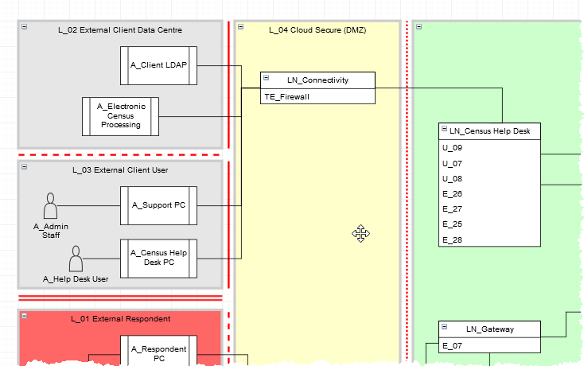

There are a large list of model validation rules associated with each of the Operational Model views. First there is a strict parent-child relationship between an OMLocation and an Actor or Node (Logical or Physical). In general an Actor or a Node should only appear within a single OMLocation and cannot appear more than once one a diagram.

Note, that different LOM (and POM) views may be created to show different deployments or different candidate technology mappings. Thus it is possible for a Node to appear within different OMLocations in different views, however you probably want to make this an exceptional case.

#### LOM and Deployment Model
In Operational Modeling, the deployment unit model, defines as set of deployment packages or deployment units (**DUs**) that taken as a whole represent the Functional Model of the system. There are four types of deployment units, *execution*, *data*, *presentation*, and *installation*. The purpose of DUs is to accurately represent *placement* decisions whereby various trade-offs of system service levels can be evaluated. Placement will impact things like latency, availability, security, performance, etc.

In IBM Architect Assistant, Community Edition, DUs get *Added to* (placed on/within) a Node. All of the pure application-level DUs will be placed on Logical Nodes (within LOM). Technical-level DUs can be placed directly on either a Logical or a Physical Node. For a user experience, selecting a Logical Node on a LOM view and reviewing its Attributes, there are two areas to be aware of.

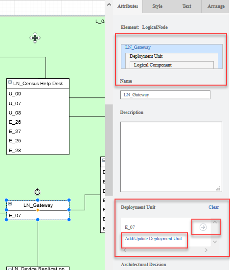

In the above diagram, note the nested relationship graphic. A Logical Node can have multiple DUs placed within it and a given DUs can package up elements of multiple Logical Components. This graphic provides navigation within this nested hierarchy, once you start drilling down.

The Deployment Unit attribute is intended to all the user to select which of the currently defined DUs are to be placed within the currently selected node.  In the example from above, LN_Gateway currently has DU, E_07, placed within it.  Clicking on the right arrow, to the right of E_07, let's you drill down and see the attributes of that particular DU.

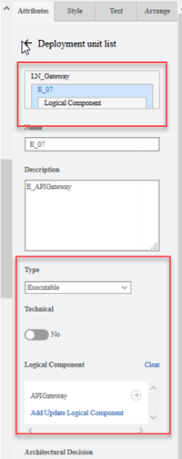

Here you can see the navigation (nested structure) is indicating you are editing DU E_07, a child of LN_Gateway. You also see the key attributes of a DU including its type, whether it is a Technical DU, and the collection of defining Logical Components. From a user experience perspective, the Logical Component attribute of a DU behaves just like the DU attribute of a Logical Component. Here you can manipulate the list of Logical Components and for those already selected, you can drill down to view/edit the specific Logical Component.

At this level (or back at the DU attribute level), clicking on the *Add/Update xxx* link will present the user with a list of elements of the appropriate type each with a checkbox to add/remove their association with the current element.

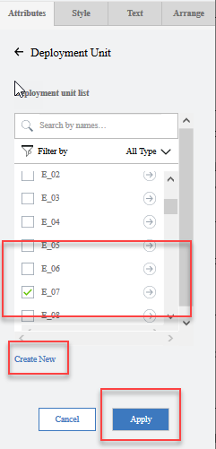

Currently, this is the only way to define/create a DU within IBM Architect Assistant, Community Edition. You can see the list of defined DUs. If the DU you need to associate with the Node does not appear, then you click **Create New** and you are taken to a new DU attribute panel where you can supply all of the attributes including *Name*. **Note**, when you define DUs, there are two distinct model operations that you need to signal to IBM Architect Assistant, Community Edition. First, on the DU attribute page, there is a **Save** button at the bottom. After filling in the details for a new DU, you must click Save to have that element be created. You will then be returned back to the DU list screen, where you can separately choose to add it to the current Node or not. Making changes to the list of *placed* DUs but be confirmed by clicking the **Apply** button.

**Existing Element Palettes** In the LOM view, you will find a set of palettes as seen in the diagram below.

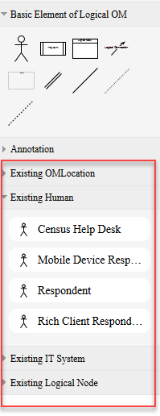

Here you will find listed all of the elements that exist in this solution architecture that can be placed on the LOM diagram. This allows for a much more efficient drag to reuse user experience. Note, once an element appears on the current diagram, it will be removed from this list of "existing elements (available for use in this diagram)" since that element is currently "in use on the diagram".  These existing element palettes are available in LOM views, POM views, and Use Case Diagram views at the moment.

([Back to Top and TOC](#ibm-it-architect-assistant-community-edition---detailed-authoring-by-artifact-type))

### Operational Model - POM View
There are 5 key modeling elements front and center in a LOM view: OMLocations, Actors, Physical Nodes, Logical Nodes, and Physical Connections (or Networks). In addition the diagram palette includes element representing different Border types.

Physical Nodes come in 3 types, Physical, Virtual, and Container. Physical Connections come in to types, point-to-point and multi-point.

The POM view is the most complex diagram type currently supported in IBM Architect Assistant, Community Edition and represents the physical deployment of an architecture. The foundation is a set of OMLocations in which Actors and Physical Nodes are placed. Logical Nodes are then *hosted* by Physical Nodes.  Note, one can also show the *hosting* relationship between Physical Nodes, for instance you may show a Container Node hosted on a Virtual Node hosted on a Physical Node. How you model things really depends on the level of detail that you need to (or can) manage or specify.  For instance if your application is all about a set of Cloud Native microservices deployed onto a Kubernetes Cluster, then you may or may not need to worry about the configuration of the VSIs (Virtual Nodes) that host/represent the Kube cluster's nodes but may instead choose to only model the deployed Containers themselves. Either way, in this scenario, you probably don't have much control over the physical nodes the VSIs are instantiated on.

This hierarchical nesting can produce very cluttered diagrams. Thus at the diagram level you have some global controls that will show/hide different layers.

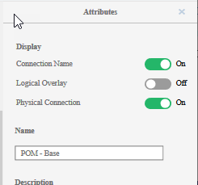

Here you see two toggle controls unique to POM view. The first, Logical Overlay, indicates whether any part of the LOM elements are shown, i.e., if the Logical Nodes hosted by the Physical Nodes are displayed along with the Logical Connections between the Logical Nodes. By default this is turned off.
The second control, is whether to show Physical Connections on the diagram. With it turned off just the OMLocations, Physical Nodes and Actors will be shown on the diagram.

Physical Nodes have a rich set of attributes that one might like to document, including numbers/type of CPU/Cores, amount of memory, available network ports, and the associated OS/Hypervisor. Also included in information about the Deployment Offering (Managed, Hosted, on-prem, ...) as well as Deployment Provisioning (org responsible for provisioning). Obviously you can easily include other noteworthy attributes/characteristics as part of the Physical Node's description.

#### Linked (Synchronized) LOM/POM
For most basic solution architectures, one will likely create a LOM view to establish the OMLocations as well as the basic logical packaging of functionality, i.e., define the Logical Nodes along with the DUs that are hosted by these nodes. Then you will create the physical topology in at least one POM view. IBM Architect Assistant, Community Edition provides a productivity enhancement for these simple cases. When you create a POM view and there is at least one LOM view defined, you will get a dialog like the one shown below.

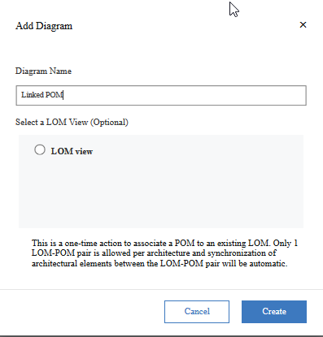

By selecting a LOM view to link to the POM view being created, a number of things happen. First all of the OMLocations and Actors from the LOM view are copied into the new POM view. Further, going forward, the tool will synchronize changes between these views. For instance when you drag a Logical Node onto a Physical Node in the POM that also in turn specifies a relationship between the Logical Node and the enclosing OMLocation. This will be synchronized back to the LOM, potentially moving the Logical Node to the "new" OMLocation or remove it from the LOM if the target OMLocation doesn't exist in the LOM.

The set of synchronization rules become very complex were the tool to try and support it across more than a single pair of diagrams. As a result, only a single linked pair of LOM-POM is supported. Also note, you do not need to use this feature at all although it does a lot of validation and consistency checking for you when you do use it.

As implied earlier, other than defining the topology of OMLocations, Physical Nodes and Physical Connections (networks) within a POM View, the other major task is then placing the Logical Nodes onto this deployment topology. Here is where having the "**Existing Element**" palettes become particularly useful. Here you can just open up the list of available Logical Nodes and drag each one onto the hosting Physical Node. Once you add a Logical Node to the diagram, the *Logical Overlay* toggle switch will get turned on.  Thus you should be able to verify that the Physical Connections are available to support the specified set of Logical Connections. Again you can toggle this off at any time to simplify the view. The list of Logical Nodes hosted by a Physical Node are always visible in the Physical Nodes' attribute panel.

From a style perspective, Physical and Logical Nodes are simple rectangles that are containers. This is to make it easy to create the nesting (*hosting*) relationships via drag into. However, there will be times in which a simplified POM view may be desired (for certain with Logical Overlay disabled) where you may want more stylistic icons for the various nodes. Just like any other symbol in any of the views you can customize the style via the Style panel see the discussion in the basic Authoring section of the [Overview section of the User Guide](../../master/docs/Cognitive-Architect-Home.md).

([Back to Top and TOC](#ibm-it-architect-assistant-community-edition---detailed-authoring-by-artifact-type))

## Viability Viewpoint

### Viability - Risks
Risks are identified for a project and need to be addressed. Like other text based elements, Risks can be edited via a "web form" style editor. Each Risk has a set of attributes:

- **Name** - This is a text name which should provide an indication of what the risk is.
- **Risk Description** - This is text that should provide the details of the risk
- **Probability** - [Low, Medium, High] An indication of the likelihood of the risk to manifest.
- **Effort/Cost** -  This describes the effort or cost associated with managing the risk.
- **Impact** - [Low, Medium, High] An indication on level of impact on project success.
- **Contingency/Mitigation recommendation** - What is the recommended approach for managing the risk.
- **Person Responsible** - Entered as a name or email address of the responsible party for making sure this risk is managed.
- **Review Date** - Ability to schedule a review.

Risks are generally managed and reviewed as a table or spreadsheet. As such the Excel import and Excel export utilities of IBM Architect Assistant, Community Edition are extremely useful when working with Risks. 

([Back to Top and TOC](#ibm-it-architect-assistant-community-edition---detailed-authoring-by-artifact-type))

### Viability - Assumptions
Assumptions can be made at any level within Solutioning. The text based Assumptions can be edited via a "web form" style editor. Each Assumption has a set of attributes:

- **Name** - This is a text name which should provide an indication of what the system needs to provide
- **Assumption Description** - This is text that should provide the details for the assumption.
- **Impact** - [Low, Medium, High] An explanation of the significance or impact of  this assumption.
- **Confidence Level** - [Low, Medium, High] used to indicate confidence in the validity of the assumption.
- **Assumption identified by** - Entered as a name or email address of the responsible party for making sure this requirement is addressed by the system.
- **Review Date** - Ability to schedule a review.
- **Close Date** - Date Assumption is verified (if applicable).
- **Is a Key Assumption** - Yes/No

Assumptions are generally managed and reviewed as a table or spreadsheet. As such the Excel import and Excel export utilities of IBM Architect Assistant, Community Edition are extremely useful when working with Assumptions. 

([Back to Top and TOC](#ibm-it-architect-assistant-community-edition---detailed-authoring-by-artifact-type))

### Viability - Issues
Functional Requirements (FRs) are a complementary (or alternative) way to describe what the target system is expected to be able to do. Like the text based Use Cases, FRs can be edited via a "web form" style editor. Each FR has a set of attributes:

- **Name** - This is a text name which should provide an indication of what the risk is about
- **Issue Description** - This is text that should provide the details of the Risk.
- **Priority** - [Low, Medium, High] used to prioritize across Issues.  Note High Priority issues may get elevated to risks.
- **Raise by** - Entered as a name or email address of the party raising the issue.
- **Issue Responsibility** - or owner; the name or email address of the party responsible for tracking the issue.
- **Review Date** - Ability to schedule a review.
- **Action** - [Closed, Risk Change Reference]
- **Is a Key Issue** - Yes/No

Issues are generally managed and reviewed as a table or spreadsheet. As such the Excel import and Excel export utilities of IBM Architect Assistant, Community Edition are extremely useful when working with Issues. 

([Back to Top and TOC](#ibm-it-architect-assistant-community-edition---detailed-authoring-by-artifact-type))

### Viability - Dependencies
Dependencies document those items outside of the direct control of this solution project that impact this project. Dependencies can be edited via a "web form" style editor. Each FR has a set of attributes:

- **Name** - This is a text name which should provide an indication of what the Dependency is about
- **Dependency Description** - This is text that should provide details on the Dependency
- **Effect on Plan** - An explanation of how this dependency effects this project.
- **Owner** - Entered as a name or email address of the responsible party for making sure this dependency is tracked.
- **Required by Date** - When must the dependency get complete (or otherwise impacts project).
- **Associated Risk** - A Risk name that results from the Dependency not being fulfilled.
- **Closed Date** - When the Dependency is fulfilled.
- **Is a Key Dependency** - Yes/No

Dependencies are generally managed and reviewed as a table or spreadsheet. As such the Excel import and Excel export utilities of IBM Architect Assistant, Community Edition are extremely useful when working with Dependencies. 

([Back to Top and TOC](#ibm-it-architect-assistant-community-edition---detailed-authoring-by-artifact-type))

### Architectural Principles
Architectural Principles represent an external set of guidelines or constraints. They are used to deliver consistent design guidance across an organization, initiative or other scope. Architectural Principles can be edited via a "web form" style editor. Each Principle has a set of attributes:

- **Name** - This is a text name which should provide an indication of what the Principle addresses
- **Description** - This is text that should provide clear details about the Principle and how to apply it.
- **Ranked Priority** - An integer value.  This is used to provide the order in which Architectural Principles are applied on this solution design.  Since Architectural Principles may be conflicting in some aspects, having the ranked, insures a consistent application of the principles and their impact on the solution architecture.
- **Rationale** - A description for why it is important and why it is to be imposed.
- **Implications** - Applying this principle has implications or side-effects.  This attribute is used to clearly identify those implications.
- **Metrics** - Details about the measures and metrics that are impacted by applying this principle.

Architectural Principles are generally managed and reviewed as a table or spreadsheet. As such the Excel import and Excel export utilities of IBM Architect Assistant, Community Edition are extremely useful when working with Architectural Principles. 

([Back to Top and TOC](#ibm-it-architect-assistant-community-edition---detailed-authoring-by-artifact-type))

### Notes
Notes are designed to provide flexibility for packaging all the elements you need to manage with a Solution Design / Architecture. You will frequently receive reference documents and content from the client that you want to manage. For these you can create a Note artifact instance and attach documents and/or images. In addition to client artifacts, you may capture other artifacts not formally supported in the Table of Contents, for example, you might capture a set of Design Thinking artifacts, e.g., Empathy Map, As-Is Scenario Map, etc.  These can be added to the Solution Design as Notes.

Notes instances have a name, and a rich text block. The rich text (document) support inserting images and attaching documents/files. Within the set of Notes you can define *Labels*. 

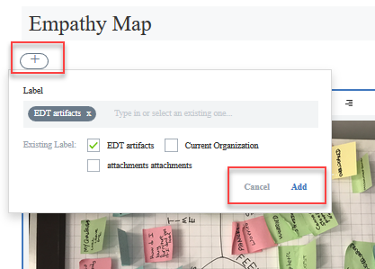

Filters are a set of logical tags that can be associated with each of your Notes instances. Back on the Notes overview page (with all of the Notes instance cards visible) you can apply filters to select which Labels are active and thus which instances will be visible.  This helps to organize a potentially large set of Notes.

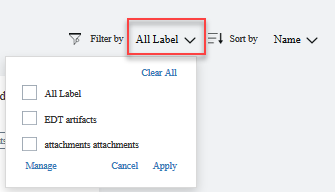

([Back to Top and TOC](#ibm-it-architect-assistant-community-edition---detailed-authoring-by-artifact-type))

